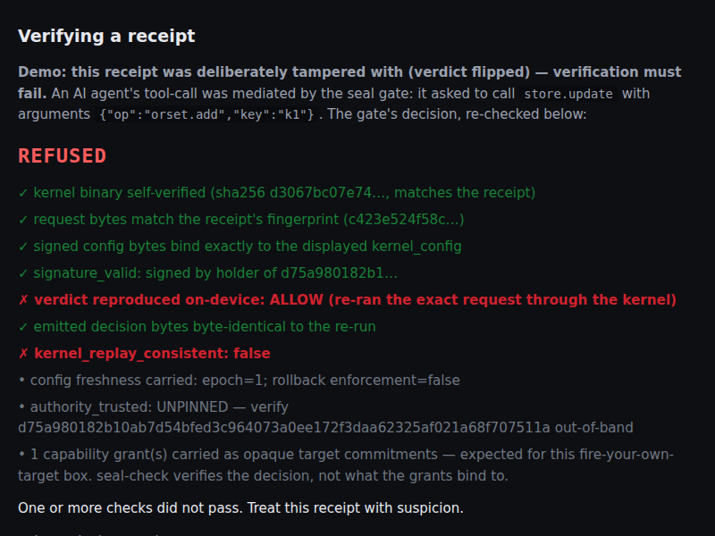

# seal-check

[](https://github.com/velvetmonkey/seal-check/actions/workflows/ci.yml)

**Paste a receipt. A tampered one fails in your browser — the real kernel verifies its signed config and re-derives the verdict live. No server, no account, no faith required.**



<sub>The shipped tamper example, refused. The signature is valid and the request bytes match — those checks pass. What fails is the re-run: the kernel re-derives `ALLOW` from the receipt's own call and config, the receipt claims `BLOCK`, so `kernel_replay_consistent: false`. Note `authority_trusted: UNPINNED` in the same panel: the browser path verifies the decision, never operator authority. Reproduce with `python3 -m http.server 8000` and the "Verify a TAMPERED receipt" button.</sub>

Drop a tool-call or receipt JSON (or open a deep link). seal-check re-runs the proven decision procedure over the exact bytes. Genuine receipts can be authentic and replay-consistent; operator authority additionally requires an independently provisioned public-key pin.

One command serves the page. Click the tamper example and watch it fail. That's the product.

## Quick start: verify, then tamper

*Browser (the product):* serve the page and click the tamper example.

```bash
python3 -m http.server 8000   # then open http://localhost:8000 and hit "Verify a receipt"
```

The page bundles the pinned wasm kernel (sha256 `28bb3ae7…`, re-hashed in your browser against the pinned constant), re-runs it over the exact bytes, and shows the verdict row. Browser deep links are deliberately **UNPINNED**: they verify signature and replay consistency but do not establish operator authority. Nothing leaves the browser.

## Two honest paths

**1-minute showcase — two honest paths**

*Terminal (same wasm, no browser):* `node test/verify-file.cjs <receipt> --expected-config-pubkey <independently-provisioned-public-key>` exits 0 only when signature, replay, bindings, and the relying-party pin all agree. Unpinned consistency exits 3; verification failure exits 1. An unparseable-request receipt (§11.1) is a distinct reduced-scope state — signature and kernel-attested request binding hold but no independent replay is possible — and exits 4, never 0. The browser and terminal load the identical `wasm/seal.js`.

**Paste this — a real receipt you can try right now**

A genuine ALLOW receipt is shipped at [`examples/allow.receipt.json`](examples/allow.receipt.json). Paste it into the page: signature and replay pass, while authority remains visibly unpinned. For the deterministic test receipt, independently pin its documented test public key when exercising the authorised CLI leg.

Now tamper with it: change `"verdict": "ALLOW"` to `"verdict": "BLOCK"` and re-paste. It FAILS — the kernel re-derives `ALLOW` from the receipt's own call and config, so the flipped verdict no longer matches (`verdictMatch: false`, `allGood: false`). No server, no account, no taking our word for it. Verified on this machine:

```
verifyReceipt(genuineText).outcome = "unpinned"   allGood = false
verifyReceipt(genuineText, { expectedConfigPubkey }).outcome = "authorised"   allGood = true
verifyReceipt(tamperedText).allGood = false   verdictMatch = false
verifyReceipt(JSON.parse(genuineText)).outcome = "unverified-document"   // an already-parsed object never verifies a wire claim (§12.6)
```

The full artifact carries the exact `signed_config`, `kernel_config`, `certs`, and hashes the verifier re-derives, so paste the complete [`examples/allow.receipt.json`](examples/allow.receipt.json) rather than a snippet — a partial receipt is meant to fail shape validation.

### Authority boundary

`signature_valid` means the config was signed by the holder of public key P. It does **not** establish that P is your operator. `authority_trusted` becomes true only when the relying party supplies `expected-config-pubkey` from an independent deploy trust file, CI configuration/secret, or environment—not from the receipt or signed policy. The public pin is non-sensitive; the operator's private signing key is crown-jewel TCB. A single-tenant deployment signs policy with its private key and separately pins the public key in verifier deployment configuration.

Receipt replay proves receipt↔kernel consistency. The separate 13/13 wasm-versus-Lean differential is the correctness evidence. The signed config carries `epoch`, which the verifier surfaces, but rollback of an older valid signed config remains possible until a stateful relying party enforces a high-water mark.


<!-- truthbox:begin -->
> **Runtime profile: `compatible`.** Strict `canonical-l0` is proved and modelled, not the deployed route yet.
> **Claim:** policy-covered request-effects recognised by the compatible MCP boundary reach the downstream child MCP server only after every applicable Lean kernel returns Allow. Effects configured as guarded additionally require a matching live approval record. Seam failures block; every mediated decision emits replayable evidence.
> **Non-claim:** the deployed host is not proved end to end, and canonical parser rejection is not currently the runtime gate. Host `ApprovalRecord` tokens are a separate signed channel from the v2 kernel-defined approval tuple. “Canonical” in Seal names the pinned kernel byte rule, not RFC 8785/JCS. Seal verifies the configured authorization evidence. Whether that evidence represents the intended human, device or service is an identity and key-custody assumption, not a proved property.
<!-- truthbox:end -->
> Map: [EVALUATOR-START.md](https://github.com/velvetmonkey/seal/blob/main/EVALUATOR-START.md) · profile detail: [PROFILE.md](https://github.com/velvetmonkey/seal-host/blob/main/PROFILE.md) — both in public repos; the links resolve for everyone.

<!-- TODO(asset, shot #4): real screenshot — the verdict row + decision-receipt panel
     (Allow/Block + the JSON receipt) from the live page. It IS the product; capture it,
     do not illustrate it. -->
<!-- TODO(asset, shot #3, PROMO-GRADE): real screen-capture GIF — "Verify a TAMPERED
     receipt" failing in front of you (the money shot from index.html §1b). -->


## What happens when someone hands you a decision receipt

Receipts arrive as deep links: open the page with `#receipt=<base64url of the receipt JSON>` and it is re-verified in your browser. The page hashes its bundled wasm, verifies the receipt's real Ed25519 config signature, binds the displayed config to the exact signed payload, re-runs the same kernel, and compares the emitted bytes. Because a browser deep link has no independently provisioned key pin, it reports authentic + replay-consistent but unpinned, never authorised.

Nothing you paste leaves the page. The page verifies a decision artifact; it does not certify that your whole deployment is correctly wired through Seal.

## For evaluators and auditors

Seal's proof story is intentionally narrow. The Lean theorems cover the mediation kernel and selected model properties. The binaries and browser artifacts are connected to that proof by reproducible conformance tests, not by a theorem about every compiled instruction. For this page's wasm specifically, a differential harness drives identical inputs through the deployed `seal.wasm` and the proven model: currently 13/13 mediation-corpus adversarial cases agree with 0 disagreements — evidence, not a theorem ([assurance statement](docs/SEAL-ASSURANCE-STATEMENT.md)).

Start with the family [claims matrix](https://github.com/velvetmonkey/seal/blob/main/docs/CLAIMS-MATRIX.md) (one table: proven / tested / assumed / not claimed) and [What Seal is NOT](https://github.com/velvetmonkey/seal-assurance-kit/blob/main/docs/WHAT-SEAL-IS-NOT.md), then [docs/PROOF-REFERENCE.md](docs/PROOF-REFERENCE.md) for theorem names and file locations, [docs/CONFORMANCE.md](docs/CONFORMANCE.md) for the byte-identity claim, and [docs/TCB.md](docs/TCB.md) for what remains trusted.

Mandatory non-claims (canonical copy: [docs/LIMITATIONS.md](docs/LIMITATIONS.md)):

<!-- claims:begin -->
- Seal proves properties of the mediation KERNEL, not of the whole deployed system.
- Seal does NOT prove SHA-256 collision resistance in Lean; it is a named, scoped cryptographic assumption (A-CR).
- The deployed Rust / wasm / JS are NOT proven bug-free; they are tied to the proof by byte-exact conformance testing over a corpus, not for every possible input.
- Seal guarantees AUTHORIZATION match, not INTENT match: if a human approves a malicious-but-valid request, Seal will execute it.
- Seal does NOT prevent compromise of hosts, browsers, build systems, keys, operators, or downstream tools.
- Seal's audit chain is tamper-EVIDENT, not tamper-IMPOSSIBLE.
- Seal does NOT make the AI smarter or prevent hallucinations; it stops an unapproved effect.
- Axiom footprint {propext, Classical.choice, Quot.sound} is the minimal classical fragment; no extra axioms.
- The axiom-footprint line is a per-theorem ceiling for theorems named in the family's axiom-pin gates; it is not a repository-wide census. Pin scope and named exceptions are indexed in the seal claims matrix (seal/docs/CLAIMS-MATRIX.md).
<!-- claims:end -->

## Verify in five minutes

Open the page (the wasm fetch needs http, not file://):

```sh
python3 -m http.server 8000   # then visit http://localhost:8000
```

Reproduce off-browser — these are standalone, need no server, and run the same
shipped wasm under Node:

```sh
node test/receipt-format.test.cjs
node test/receipt-harness.cjs
node test/cross-receipt.test.cjs
node test/receipt-verify.test.cjs   # negative paths: tampered receipts must FAIL
node test/receipt-format-v3.test.cjs # v3 record_version 3 + Object B signature
node test/receipt-document.test.cjs  # §12.6: the received bytes, not just the parsed object
```

## The Seal family

_The Seal fleet repositories are public; these links resolve for everyone. `witness-check` remains proprietary._

- [seal](https://github.com/velvetmonkey/seal): the public umbrella story, product map, and evaluator path.
- [mcp-seal-dev](https://github.com/velvetmonkey/mcp-seal-dev): The rulebook, proven.
- [seal-host](https://github.com/velvetmonkey/seal-host): The guard at the door.
- [seal-check](https://github.com/velvetmonkey/seal-check): Don't trust. Verify.
- [seal-live-demo](https://github.com/velvetmonkey/seal-live-demo): Watch it work.
- [seal-assurance-kit](https://github.com/velvetmonkey/seal-assurance-kit): Check your own boundary.
- [witness-check](https://github.com/velvetmonkey/witness-check): The sufficiency analyzer. (proprietary)
- [seal-verify-action](https://github.com/velvetmonkey/seal-verify-action): Gate receipts in CI.

## Documentation

- [What Seal is NOT](https://github.com/velvetmonkey/seal-assurance-kit/blob/main/docs/WHAT-SEAL-IS-NOT.md) — read this first (public kit repo)
- [Family claims matrix](https://github.com/velvetmonkey/seal/blob/main/docs/CLAIMS-MATRIX.md) · [family architecture map](https://github.com/velvetmonkey/seal/blob/main/docs/ARCHITECTURE.md) (public umbrella)
- [Architecture](docs/ARCHITECTURE.md)
- [Threat model](docs/THREAT-MODEL.md)
- [Assumptions](docs/ASSUMPTIONS.md)
- [Proof reference](docs/PROOF-REFERENCE.md)
- [Conformance](docs/CONFORMANCE.md)
- [Trusted computing base](docs/TCB.md)
- [Glossary](docs/GLOSSARY.md)
- [Limitations](docs/LIMITATIONS.md)
- [Security policy](SECURITY.md)

## License

Apache-2.0. See [LICENSE](LICENSE).
